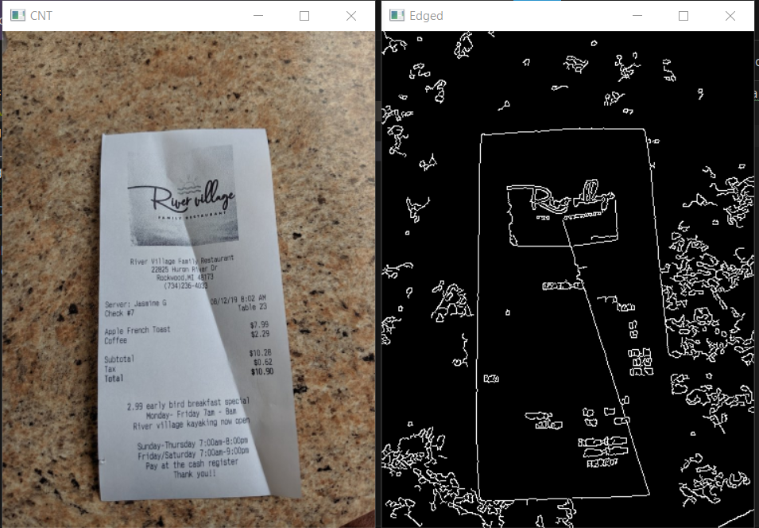
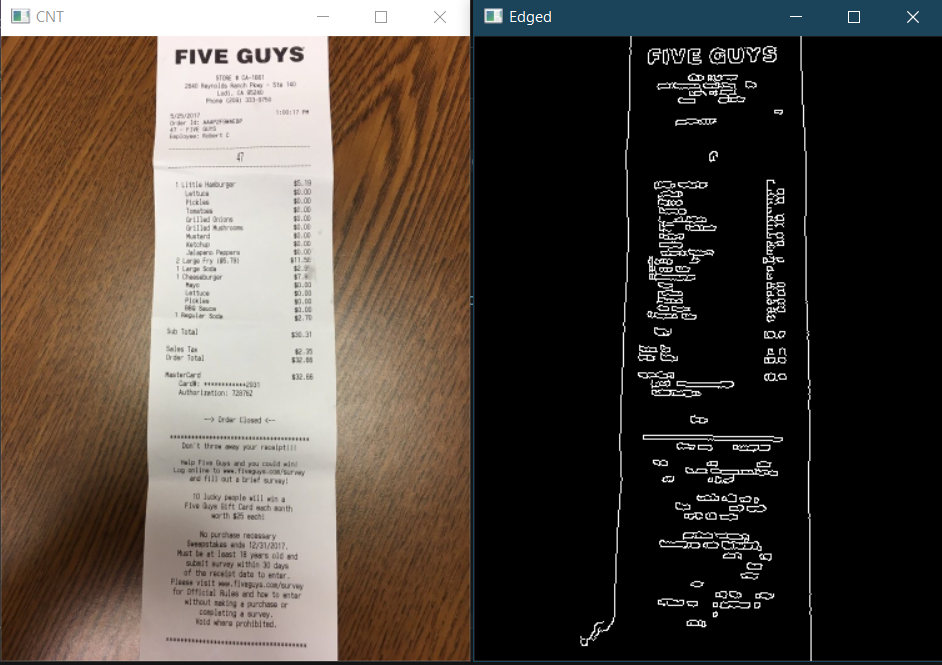
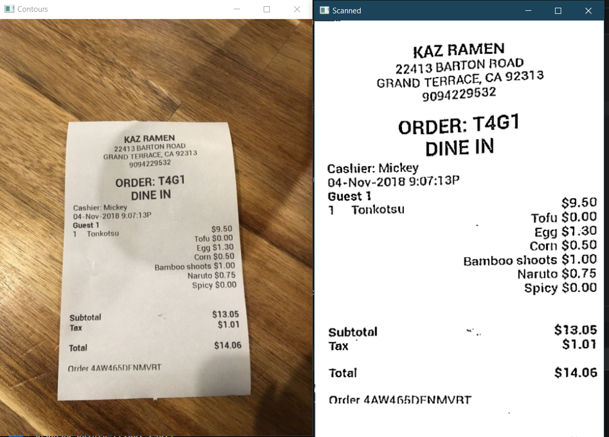

# Biblioteka do Skanowania Paragonów

Niniejsza biblioteka służy do skanowania paragonów oraz odczytywania ich wartości. Choć działa, wciąż wymaga wielu poprawek i usprawnień, aby uzyskać
lepszą dokładność i wydajność.

## Przykład 1

Pierwszym krokiem jest zabawa z parametrami, aby uzyskać kontury obrazka poniżej, unikając przy tym efektów cienia. Użyte zdjęcie
to `1069-receipt.jpg`.

## Przykład 2

Kolejnym zagadnieniem jest sytuacja, gdy paragon wychodzi poza krawędzie zdjęcia. W takim przypadku obecnie rzucamy
wyjątek `FailedFindEdgesException`, co wymaga dalszej pracy nad obsługą takich scenariuszy.

## Przykład 3

Tak to powinno wyglądać dla każdego paragonu. Zauważmy, że dla tego zdjęcia cały paragon został na nim umieszczony, jest mało cienia oraz jednolite tło.

Więcej zdjęć jest pod linkiem: https://expressexpense.com/blog/free-receipt-images-ocr-machine-learning-dataset/
